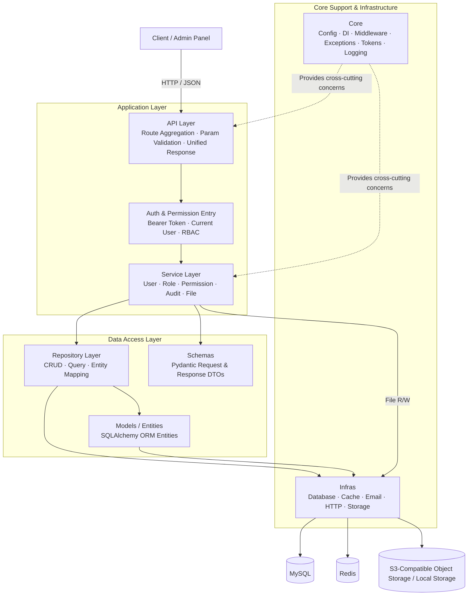
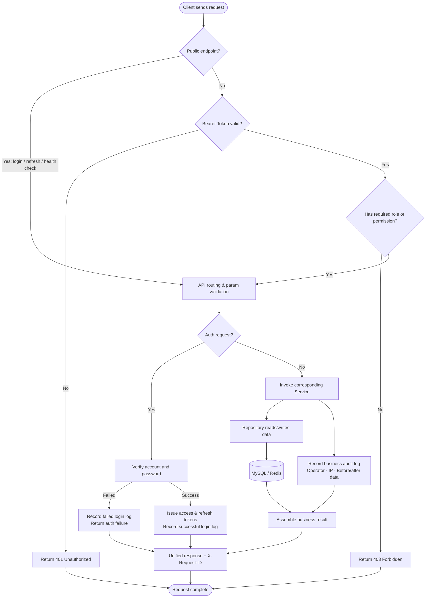
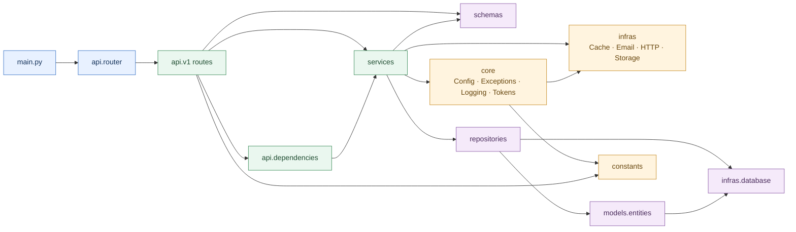

# HanJiang

[中文](README.md) | English

---

## Introduction

HanJiang (汉江) is a production-grade Python Web application framework built on top of FastAPI, following industry best engineering practices. It provides a standardized, modular, highly extensible, and maintainable backend service infrastructure.

The project is ready to use out of the box, featuring a standard three-layer architecture (API → Service → Repository), FastAPI native dependency injection, dual configuration system, unified authentication with RBAC access control, structured logging, business audit, S3-compatible object storage, and idempotent seed data initialization. It enables rapid development of enterprise-grade RESTful APIs suitable for local development, testing, and multi-environment production deployment.

## Quick Start

### 1. Requirements

| Tool | Version |
|------|---------|
| Python | >= 3.11 |
| uv | latest (recommended) |
| MySQL | >= 8.0 |
| Redis | >= 7.0 |

**Windows:**
```powershell
powershell -ExecutionPolicy ByPass -c "irm https://astral.sh/uv/install.ps1 | iex"
```

**Linux:**
```bash
curl -LsSf https://astral.sh/uv/install.sh | sh
```

**macOS:**
```bash
curl -LsSf https://astral.sh/uv/install.sh | sh
```

### 2. Clone the Repository

```bash
git clone https://github.com/cross-lang/x-HanJiang.git
cd x-HanJiang
```

### 3. Install Dependencies

```bash
# Install all dependencies (production + development)
uv sync

# Production only
uv sync --no-dev
```

### 4. Configuration

The project supports both `.env` environment variables and `config.yaml` configuration files. Configuration precedence: **environment variables > environment-specific YAML (config.{env}.yaml) > default YAML (config.yaml) > code defaults**.

**Option 1: Using `.env` file (recommended)**
```bash
cp .env.example .env
```

**Option 2: Using `config.yaml` file**
```bash
cp config.yaml.example config.yaml
```

**Core configuration parameters:**

| Parameter | Environment Variable | Description |
|-----------|---------------------|-------------|
| `APP_ENV` | `APP_ENV` | Runtime environment: `development` / `testing` / `production` |
| `SERVER_HOST` | `server.host` | Listen address, default `0.0.0.0` |
| `SERVER_PORT` | `server.port` | Listen port, default `8000` |
| `AUTH_SECRET_KEY` | `auth.secret_key` | JWT signing key; must be overridden with a random string >= 32 chars in production |
| `MYSQL_HOST` | `database.host` | MySQL host address |
| `MYSQL_PORT` | `database.port` | MySQL port, default `3306` |
| `MYSQL_USER` | `database.user` | MySQL username |
| `MYSQL_PASSWORD` | `database.password` | MySQL password |
| `MYSQL_DATABASE` | `database.database` | MySQL database name, default `hanjiang` |
| `REDIS_HOST` | `redis.host` | Redis host address |
| `REDIS_PORT` | `redis.port` | Redis port, default `6379` |
| `REDIS_PASSWORD` | `redis.password` | Redis password |
| `STORAGE_PROVIDER` | `storage.provider` | Storage backend: `local` (local filesystem) / `s3` (S3-compatible object storage) |

> **Production**: Inject sensitive configuration such as `AUTH_SECRET_KEY`, database password, and Redis password via environment variables to avoid committing secrets to version control.

> **Secret key generation**:
> ```bash
> python -c "from src.core.security import generate_secret_key; print(generate_secret_key())"
> ```

### 5. Start the Service

#### Option 1: Local Development with Hot Reload (Recommended)

```bash
# Start with CLI command (hot reload)
uv run x-HanJiang --reload

# Or start with uvicorn directly
uv run uvicorn src.main:app --reload --host 0.0.0.0 --port 8000
```

#### Option 2: Docker Deployment

```bash
docker-compose up --build
```

> Docker deployment requires a `.env` file with `AUTH_SECRET_KEY`, `MYSQL_PASSWORD`, `REDIS_PASSWORD` and other required environment variables configured in advance.

After startup:
- Swagger interactive docs: http://localhost:8000/docs
- ReDoc read-only docs: http://localhost:8000/redoc
- Health check: http://localhost:8000/api/v1/health

### 6. Common Engineering Commands

```bash
# Run unit tests (with coverage report)
uv run pytest tests/ -v --cov=src --cov-report=term-missing

# Code formatting
uv run ruff format src/ tests/

# Static code analysis
uv run ruff check src/ tests/

# Type checking
uv run mypy src/

# Initialize database tables (also done automatically on app startup)
uv run python -c "from src.infras.database import init_db; init_db()"
```

### 7. Usage Examples

**Login to obtain a token:**
```bash
curl -X POST http://localhost:8000/api/v1/auth/login \
  -H "Content-Type: application/json" \
  -d '{"username": "superadmin", "password": "admin@123456"}'
```

**Access a protected endpoint with the token:**
```bash
curl http://localhost:8000/api/v1/users \
  -H "Authorization: Bearer <access_token>"
```

**Upload a file:**
```bash
curl -X POST http://localhost:8000/api/v1/files/upload \
  -H "Authorization: Bearer <access_token>" \
  -F "file=@./example.pdf" \
  -F "folder=documents"
```

**Query role permissions:**
```bash
curl http://localhost:8000/api/v1/roles/1/permissions \
  -H "Authorization: Bearer <access_token>"
```

> After first deployment, you can log in with the default superadmin account: `superadmin` / `admin@123456`. Be sure to change this password in production.

## Project Structure

```
x-HanJiang/
├── .env.example              # Environment variable template
├── config.yaml.example       # YAML configuration file template
├── alembic/                  # Database migration management
│   ├── env.py                # Alembic environment configuration
│   └── versions/             # Migration version scripts
├── docs/                     # Project documentation
│   └── hanjiang.sql          # Database schema definition (6 tables)
├── examples/                 # Usage examples
├── logs/                     # Runtime log output directory
├── scripts/                  # Engineering scripts
│   ├── init_db.py            # Database initialization script
│   └── export_openapi.py     # OpenAPI spec export script
├── src/                      # Core business code
│   ├── main.py               # Application entry point (factory function, lifecycle management)
│   ├── api/                  # API layer
│   │   ├── v1/               # v1 versioned route modules
│   │   │   ├── health.py     # Health check and version info
│   │   │   ├── user.py       # User management CRUD
│   │   │   ├── auth.py       # Authentication (login/refresh/me/logout)
│   │   │   ├── role.py       # Role management and permission query
│   │   │   ├── audit.py      # Business audit log query
│   │   │   ├── file.py       # File upload
│   │   │   └── login_log.py  # Login log query
│   │   ├── dependencies.py   # DI dependency functions (Service/Repository/current_user)
│   │   ├── response.py       # Unified response wrapper
│   │   └── router.py         # Route aggregation registration
│   ├── constants/            # Business constants and enums
│   │   ├── base.py           # Describable enum base class
│   │   └── constants.py      # Global constant definitions
│   ├── core/                 # Core support modules
│   │   ├── config.py         # Configuration loading and parsing
│   │   ├── exceptions.py     # Custom exceptions and global exception handling
│   │   ├── logger.py         # Logger initialization (loguru)
│   │   ├── middleware.py     # Middleware (request ID, logging, CORS, rate limiting)
│   │   ├── security.py       # Password hashing and secret key generation
│   │   ├── seed.py           # Idempotent seed data initialization
│   │   ├── session.py        # Database session management
│   │   └── tokens.py         # JWT token issuance and verification
│   ├── infras/               # Infrastructure layer
│   │   ├── database.py       # Database connection pool and session factory (SQLAlchemy)
│   │   ├── cache.py          # Cache provider (Redis)
│   │   ├── email.py          # Email sending
│   │   ├── http.py           # HTTP client
│   │   └── storage.py        # Storage abstraction layer (local filesystem / S3-compatible)
│   ├── models/               # Data models
│   │   └── entities/         # SQLAlchemy ORM entities (6 tables)
│   ├── repositories/         # Data access layer (Repository pattern)
│   ├── schemas/              # API request/response DTOs (Pydantic BaseModel)
│   ├── services/             # Business logic layer (Service pattern)
│   └── utils/                # Utility functions
├── tests/                    # Test code
├── Dockerfile                # Docker image build (multi-stage)
├── docker-compose.yml        # Docker orchestration (App + MySQL + Redis)
├── pyproject.toml            # Project dependencies and metadata
├── uv.toml                   # uv package manager configuration
└── LICENSE                   # MIT License
```

## System Architecture

### Layered Architecture



### Core Business Flow



### Module Dependency Graph



## Tech Stack

| Category | Technology | Description |
|----------|------------|-------------|
| **Language** | Python 3.11+ | Strongly typed, async-friendly modern Python |
| **Web Framework** | FastAPI | High-performance async Python web framework |
| **ASGI Server** | Uvicorn | Lightweight ASGI server |
| **Process Manager** | Gunicorn | Production-grade WSGI/ASGI process manager |
| **Database** | MySQL 8.0 | Relational database |
| **ORM** | SQLAlchemy 2.0 | Python SQL toolkit and object-relational mapping |
| **DB Driver** | PyMySQL | Pure Python MySQL driver |
| **DB Migration** | Alembic | SQLAlchemy database migration tool |
| **Cache** | Redis 7 | Token and login state storage |
| **Object Storage** | boto3 | S3-compatible object storage (Qiniu Kodo / AWS S3 / MinIO) |
| **Validation** | Pydantic v2 | Data modeling and validation framework |
| **Config Management** | pydantic-settings | Pydantic-based configuration management |
| **Logging** | Loguru | Modern Python logging library |
| **Rate Limiting** | SlowAPI | Request rate limiting middleware |
| **Password Hashing** | bcrypt | Secure password hashing |
| **JWT** | PyJWT | JSON Web Token issuance and verification |
| **HTTP Client** | httpx | Async HTTP client |
| **Package Manager** | uv | High-performance Python package manager |
| **Linting** | Ruff | High-performance Python linter and formatter |
| **Type Checking** | mypy | Static type checker for Python |
| **Testing** | pytest | Python testing framework |
| **Containerization** | Docker | Application containerization |
| **Orchestration** | Docker Compose | Multi-container orchestration and management |

## API Documentation

The project leverages FastAPI's automatic OpenAPI specification generation, providing the following API documentation capabilities:

| Documentation Type | Access URL | Description |
|--------------------|------------|-------------|
| Swagger Interactive Docs | http://localhost:8000/docs | Online debugging, parameter input, request sending |
| ReDoc Read-Only Docs | http://localhost:8000/redoc | Well-structured read-only API documentation |
| OpenAPI JSON Spec | http://localhost:8000/openapi.json | Standard OpenAPI 3.x spec file, importable into Postman and similar tools |

### API Endpoint List

All business endpoints are prefixed with `/api/v1`.

**Health Check (Public):**

| Method | Path | Description |
|--------|------|-------------|
| GET | `/api/v1/health` | Health check (database/cache connectivity) |
| GET | `/api/v1/version` | Version information |

**Authentication (login/refresh public, others require authentication):**

| Method | Path | Description | Auth |
|--------|------|-------------|------|
| POST | `/api/v1/auth/login` | Username/email + password login | Public |
| POST | `/api/v1/auth/refresh` | Refresh token | Public |
| GET | `/api/v1/auth/me` | Current logged-in user info | Required |
| POST | `/api/v1/auth/logout` | Logout (clear Redis login state) | Required |

**User Management (Requires Authentication):**

| Method | Path | Description |
|--------|------|-------------|
| POST | `/api/v1/users` | Create user |
| GET | `/api/v1/users` | User list (pagination/keyword/status filter) |
| GET | `/api/v1/users/{id}` | User detail |
| GET | `/api/v1/users/export` | Export users (CSV) |
| POST | `/api/v1/users/{id}/update` | Update user |
| POST | `/api/v1/users/{id}/delete` | Delete user (soft delete) |

**Role Management (Requires Authentication):**

| Method | Path | Description |
|--------|------|-------------|
| POST | `/api/v1/roles` | Create role |
| GET | `/api/v1/roles` | Role list (pagination/keyword/type/status filter) |
| GET | `/api/v1/roles/{id}` | Role detail |
| POST | `/api/v1/roles/{id}/update` | Update role |
| POST | `/api/v1/roles/{id}/delete` | Delete role (soft delete) |
| GET | `/api/v1/roles/{id}/permissions` | Role permission list (with permission details) |

**Business Audit Logs (Requires Authentication):**

| Method | Path | Description |
|--------|------|-------------|
| GET | `/api/v1/audit/logs` | Query business changes by entity, action, operator, and time range |

**File Upload (Requires Authentication):**

| Method | Path | Description |
|--------|------|-------------|
| POST | `/api/v1/files/upload` | Upload file; writes to cloud storage when configured, falls back to local storage |

**Login Logs (Requires Authentication):**

| Method | Path | Description |
|--------|------|-------------|
| GET | `/api/v1/login-logs` | Login log list (pagination/user/result/type/time-range filter) |
| GET | `/api/v1/login-logs/{id}` | Login log detail |

### Access Control

- All business endpoints (except login, refresh, and health check) require the `Authorization: Bearer <token>` header
- Endpoints can declare access requirements via `require_role("role_code")` or `require_permission("perm_code")`
- The `super_admin` role bypasses role restrictions by default
- Permission evaluation results for regular users are cached in Redis by user and permission code

## Storage Configuration

The project provides a unified storage abstraction layer. Switch storage backends by changing the `storage.provider` configuration — zero changes to business code.

### Local File Storage

Suitable for development environments and small-scale deployments. Files are stored on the server's local filesystem.

```yaml
storage:
  provider: "local"
  local:
    base_dir: "static"
```

| Parameter | Description | Default |
|-----------|-------------|---------|
| `provider` | Storage backend identifier | `local` |
| `local.base_dir` | Local storage root directory | `static` |

### S3-Compatible Object Storage

Suitable for production environments. Supports Qiniu Kodo, AWS S3, MinIO, and other S3-compatible services.

```yaml
storage:
  provider: "s3"
  s3:
    endpoint_url: "https://s3.cn-south-1.qiniucs.com"
    access_key: "<your-access-key>"
    secret_key: "<your-secret-key>"
    bucket: "x-hanjiang"
    region: "cn-south-1"
    prefix: "uploads"
    public_url: ""
    use_ssl: true
```

| Parameter | Description | Default |
|-----------|-------------|---------|
| `provider` | Storage backend identifier | `s3` |
| `s3.endpoint_url` | S3-compatible service endpoint | — |
| `s3.access_key` | Access key | — |
| `s3.secret_key` | Secret key | — |
| `s3.bucket` | Bucket name | `x-hanjiang` |
| `s3.region` | Storage region | `cn-south-1` |
| `s3.prefix` | Object key prefix | `uploads` |
| `s3.public_url` | Public access domain (optional, with protocol) | — |
| `s3.use_ssl` | Enable SSL | `true` |

> **Note**: In production, inject `access_key` and `secret_key` via environment variables to avoid committing secrets. The example endpoint `https://s3.cn-south-1.qiniucs.com` is for Qiniu Kodo's South China region. Replace it with the appropriate endpoint for other S3-compatible services.

## License

This project is open-sourced under the [MIT License](LICENSE).

## References

| Technology | Official Documentation |
|------------|----------------------|
| Python | https://www.python.org/ |
| FastAPI | https://fastapi.tiangolo.com/ |
| Pydantic | https://docs.pydantic.dev/ |
| SQLAlchemy | https://docs.sqlalchemy.org/ |
| Alembic | https://alembic.sqlalchemy.org/ |
| Redis | https://redis.io/docs/ |
| uv | https://docs.astral.sh/uv/ |
| Uvicorn | https://www.uvicorn.org/ |
| Gunicorn | https://gunicorn.org/ |
| Docker | https://docs.docker.com/ |
| Docker Compose | https://docs.docker.com/compose/ |
| Loguru | https://loguru.readthedocs.io/ |
| pytest | https://docs.pytest.org/ |
| Ruff | https://docs.astral.sh/ruff/ |

## Contact

- **Author**: John Young（夜雨诗来）
- **Email**: [john.young@foxmail.com](mailto:john.young@foxmail.com)
- **Gitee**: https://gitee.com/yeyushilai
- **GitHub**: https://github.com/yeyushilai
- **Project**: https://github.com/cross-lang/x-HanJiang
